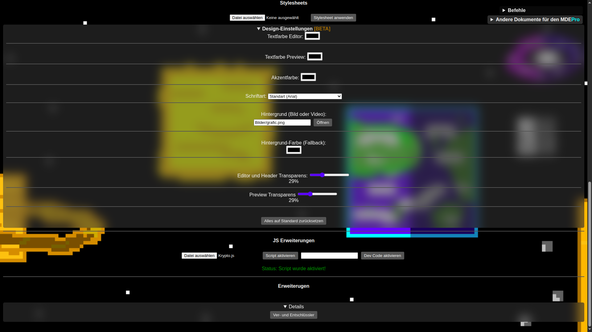
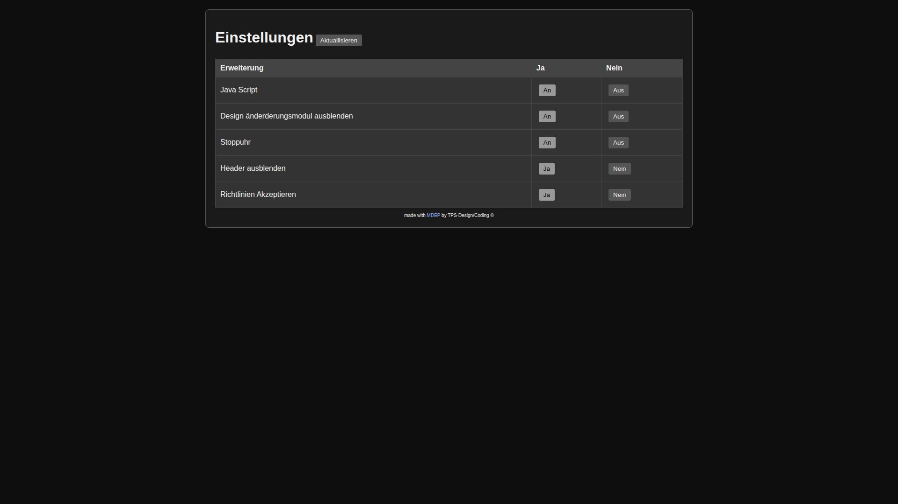
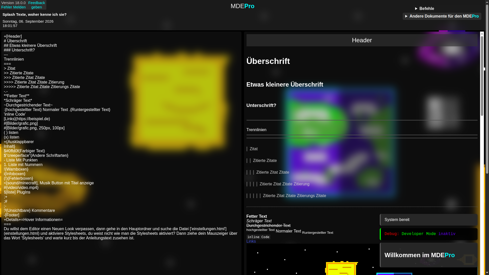

# MDEP
> Das ist mein Lieblingsprojekt, es ist ein Markdown-Editor (Pro), mein Motto ist: beste Qualität kostenlos für alle, keine Werbung, keine Kosten, aber viel Herzblut
---
## Wieso sollte ich den **MDEP** nutzen und nicht einen anderen MD Editor?
- Der **MDEP** bietet die möglichkeit Stylesheets zu importieren und das Aussehen sehr flexibel zu verändern
- Du kannst dir JavaScript erweiterungen schreiben oder schreiben lassen um den **MDEP** für dich Perfekt zu machen
- Er funktioniert offline und du brauchst keine Anmeldung

- Im **MDEP** wird keine Werbung gezeigt oder Daten von dir erfasst
- Mit den Enthaltenen `Plug-ins` kannst du Produktiver arbeiten oder nebenbei Snake Spielen
- In der `einstellungen.html` datei kannst du störende Elemente Ausschalten um Konzentrierter zu arbeiten

- Es kommen immer mal wieder Experimentelle Funktionen um die UX zu verbessern oder dir die Arbeit zu erschweren (Tagesform Abhängig)
- Wenn du möchtest kannst du sogar in älteren Schlichteren Versionen Arbeiten
- Bei jedem laden der Webseite wird dir ein Neuer Inspirierender Splash-Text angezeigt dessen Idee nicht von einem Schwedischen Pixelartigen Game stammt
- Im **MDEPro** gibt es hinter jeder Ecke Easter-Eggs findest du alle?

Ich würde Mich sehr Freuen wenn du dich für den **MDEPro** Entscheidest da er auch `Extended Markdown` mitbringt was dir sehr viele Möglichkeiten gibt

---
## Für Entwickler
- Der **MDEPro** bietet nach mehrstündiger Strukturierung einen "einfachen" einblick in den Code
- Mit dem `Developer Mode` bekommst du ein paar kleine Spielerein dazu
